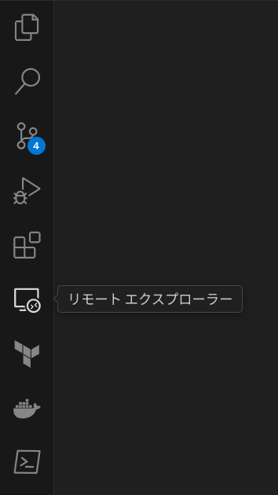
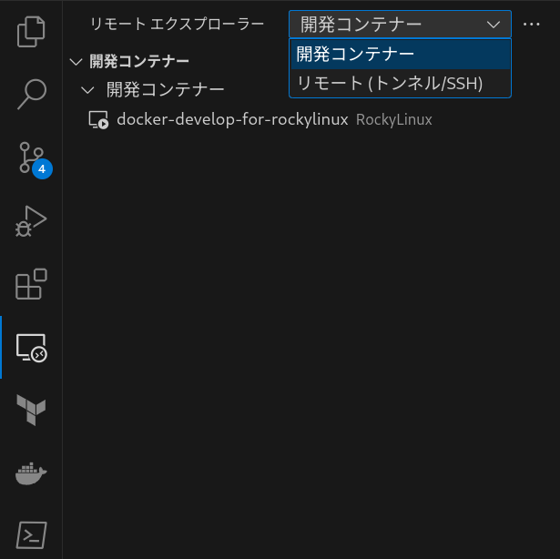
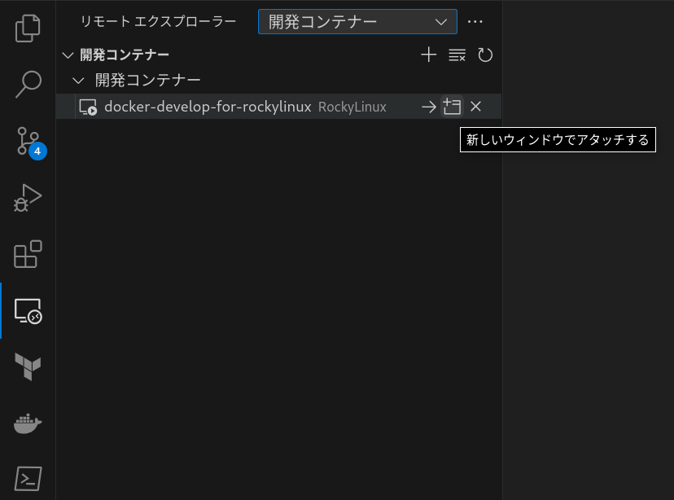

# docker-develop-for-cloudformation
[Docker](https://www.docker.com/)で[CloudFormation](https://docs.aws.amazon.com/ja_jp/AWSCloudFormation/latest/UserGuide/Welcome.html)開発環境を構築する。

<br>

# Requirement
以下のlocalhost環境で動作確認済み<br>
- [Fedora](https://fedoraproject.org/ja/)39
- [Windows](https://www.microsoft.com/ja-jp/windows/)10

<br>

# Installation
git cloneコマンドで本Repositoryを任意のディレクトリ配下にcloneする。

<br>

# Settings
[.env](./.env)を設定することで、任意の設定でContainerを実行する事が可能である。

## 実行ユーザー名の設定
[.env](./.env)内の`USER_NAME`にコンテナ起動後の実行ユーザーを設定する。

```
USER_NAME = ${実行ユーザー名}
```

<br>

## コンテナイメージ名の設定
[.env](./.env)内の`IMAGE_NAME`を任意のコンテナイメージ名に変更する。

```
IMAGE_NAME = ${コンテナイメージ名}
```

<br>

> [!WARNING]
> コンテナイメージは以下の命名規則に従うこと。<br>
> `^[a-z0-9][a-z0-9_.-]{1,}$`

<br>

> [!NOTE]
> [DockerHub](https://hub.docker.com/)へコンテナイメージのPUSHを想定する場合は以下の命名規則に従うこと。
> ```
> IMAGE_NAME = ${DockerHubユーザー名}/${コンテナイメージ名}:${タグ名}
> ```

<br>

## ボリューム名の設定(Optional)
[.env](./.env)内の`VOLUME_NAME`を任意のボリューム名に変更する。
<br>
ボリューム名が起動中のコンテナと重複しないように留意する。

```
VOLUME_NAME = ${ボリューム名}
```

<br>

## ネットワーク名の設定(Optional)
[.env](./.env)内の`NETWORK_NAME`を任意のネットワーク名に変更する。
<br>
ネットワーク名が起動中のコンテナと重複しないように留意する。

```
NETWORK_NAME = ${ネットワーク名}
```

<br>

# Usage

## コンテナ実行
本Repository直下([docker-compose.yml](./docker-compose.yml)が存在するディレクトリ)で以下のコマンドを実行する。

```bash
docker compose up -d --build
```

<br>

## コンテナ環境へのアクセス
1. VSCodeの拡張機能左メニューから拡張機能`リモートエクスプローラー`を押下する。



<br>

2. プルダウンを`開発コンテナー`に変更し、コンテナ一覧から本リポジトリ名にマウスオーバーする。



<br>

3. 右側に表示される`新しいウィンドウでアタッチする`を押下する。



<br>
