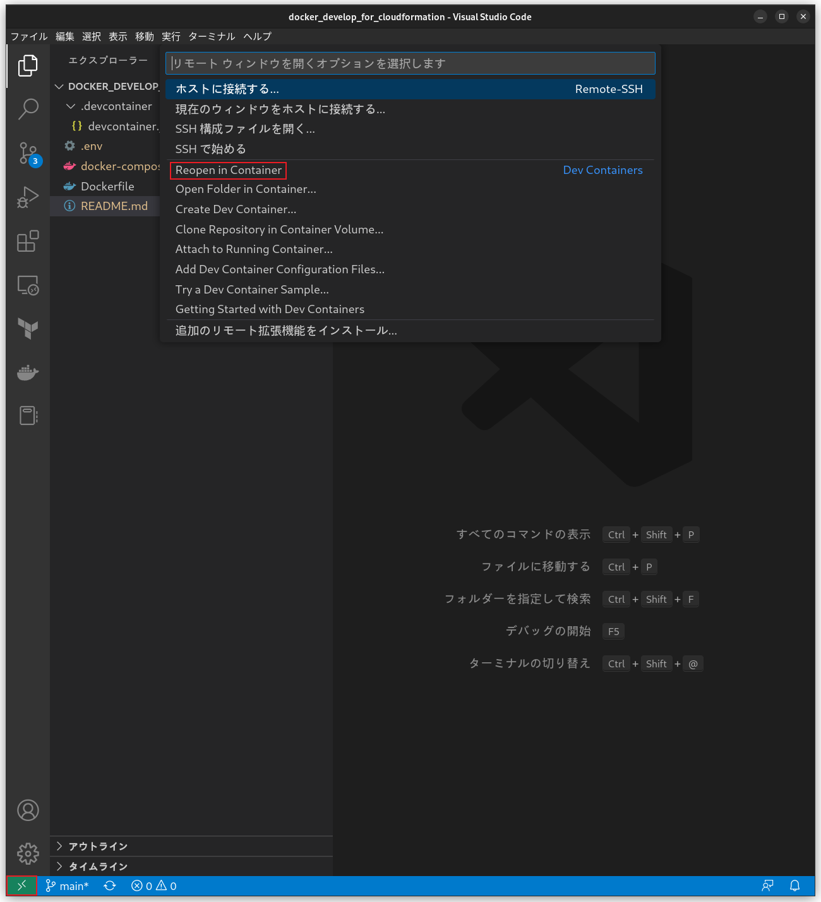
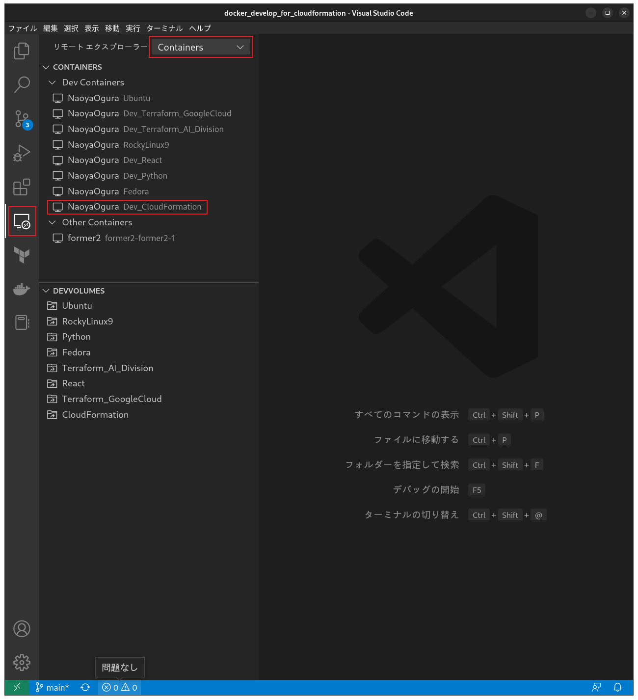

# docker_develop_for_cloudformation
DockerでCloudFormation開発環境を構築する。

<br>

# Requirement
Fedora37ローカル環境で実行確認済。
<br>
VSCodeとVSCode拡張機能をInstallする。
- VS Code
    - Docker
    - Remote Development

<br>

# Installation
git cloneコマンドで本Repositoryを任意のディレクトリ配下にcloneする。

<br>

## コンテナ名の設定
`.env`内のCONTAINER_NAMEにコンテナ名を設定する。

```
CONTAINER_NAME = ${コンテナ名}
```

<br>

## 実行ユーザーの設定
`.env`内のUSER_NAMEにコンテナ起動後の実行ユーザーを設定する。

```
USER_NAME = ${実行ユーザー名}
```

<br>

`devcontainer.json`内の`containerUser`, `workspaceFolder`にコンテナ起動後の実行ユーザーを設定する。

```json
{
	"name": "CloudFormation 開発環境",
	"dockerComposeFile": [
		"../docker-compose.yml"
	],
	"service": "cloudformation",
	"containerUser": "${実行ユーザー名}",
	"workspaceFolder": "/home/${実行ユーザー名}"
}
```

<br>

ホストマシンのOSがLinux以外の場合は、`docker-compose.yml`内の`Valid only if the host OS is Linux`とコメントされている行をコメントアウトする。

```yml
    volumes:
      - /etc/passwd:/etc/passwd:ro # Valid only if the host OS is Linux
      - /etc/group:/etc/group:ro # Valid only if the host OS is Linux
```

<br>

## ボリュームの設定
`.env`内のVOLUME_NAMEを任意のボリューム名に変更する。
<br>
ボリューム名が起動中のコンテナと重複しないように留意する。

```
VOLUME_NAME = ${ボリューム名}
```

<br>

## コンテナIPアドレスの設定
`.env`内のIPアドレスを任意の値に変更する。(例：127.0.0.3)
<br>
IPアドレスが起動中のコンテナと重複しないように留意する。

```
IP = ${IPアドレス}
```

<br>

# Usage
初回起動時
1. VSCodeを起動し、cloneした本Repositoryフォルダを開く。
2. ウィンドウ左下緑色の`"><"`を押下し、`"Reopen in Container"`を押下する。



<br>

2回目以降
1. VSCodeを起動し、左メニューから拡張機能`リモートエクスプローラー`を押下する。
2. プルダウンを`Containers`に変更し、コンテナ一覧に表示されている`Dev_CloudFormation`にマウスオーバーする。
3. `Dev_CloudFormation`右に表示される`フォルダアイコン`を押下する。

